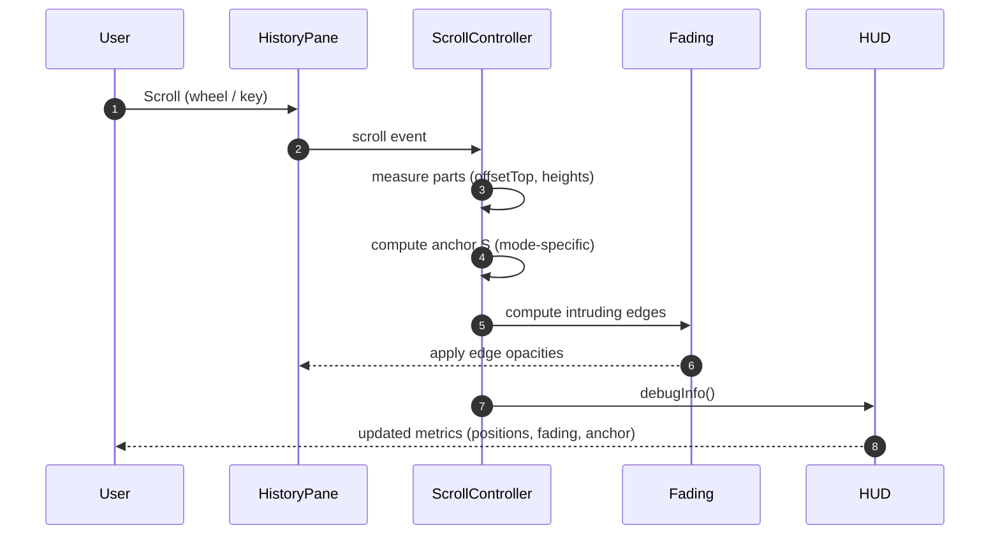

# Scroll & Fading Sequence



Anchor Formulas (pre-clamp):
- Top: S = start_part_k
- Bottom: S = start_part_k + p_k - (H_total - G)
- Center: S = start_part_k + p_k/2 - H_total/2

Fading Logic Summary:
- Top mode: fade intrusions top/bottom.
- Bottom mode: fade intrusions top/bottom.
- Center mode: symmetric fading both edges.
```
