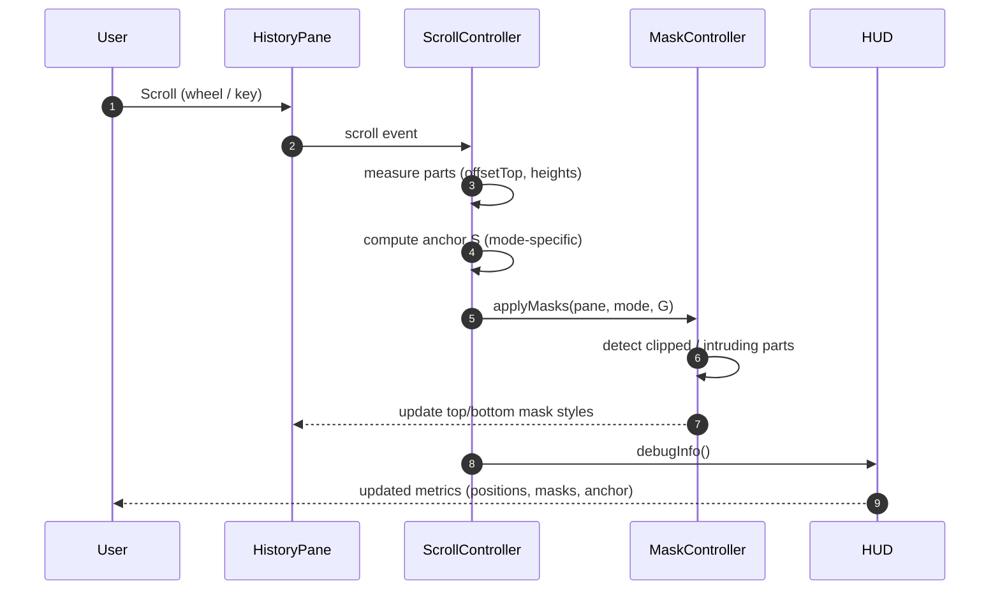

# Scroll & Mask Sequence



Anchor Formulas (pre-clamp):
- Top: S = start_part_k
- Bottom: S = start_part_k + p_k - (H_total - G)
- Center: S = start_part_k + p_k/2 - H_total/2

Mask Logic Summary:
- Top mode: (to be unified) overlay gap + bottom clipped mask.
- Bottom mode: fixed bottom gap; top overlay expands to cover G + intruding slices.
- Center mode: symmetric overlay (top like bottom mode) + dynamic bottom clipped mask.
```
