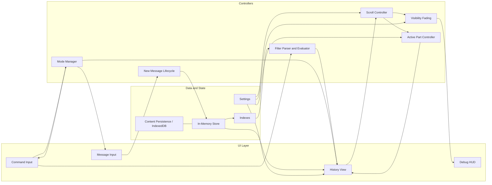

# MaiChat Architecture Overview

Key Notes:
- UI components are thin; controllers encapsulate logic.
- Store is the source of truth; persistence syncs opportunistically.
- Scroll Controller owns measurement + anchor math; Fading logic applies edge opacity.
