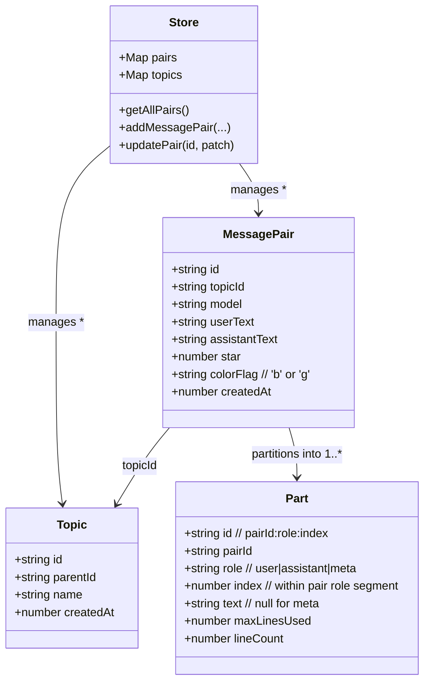

# Data Model

Notes:
- Parts are computed (partitioning) artifacts, not persisted.
- Meta parts (role=meta) inject per-pair metadata rows.
- Indexes supply derived lookup structures (omitted here for brevity).
