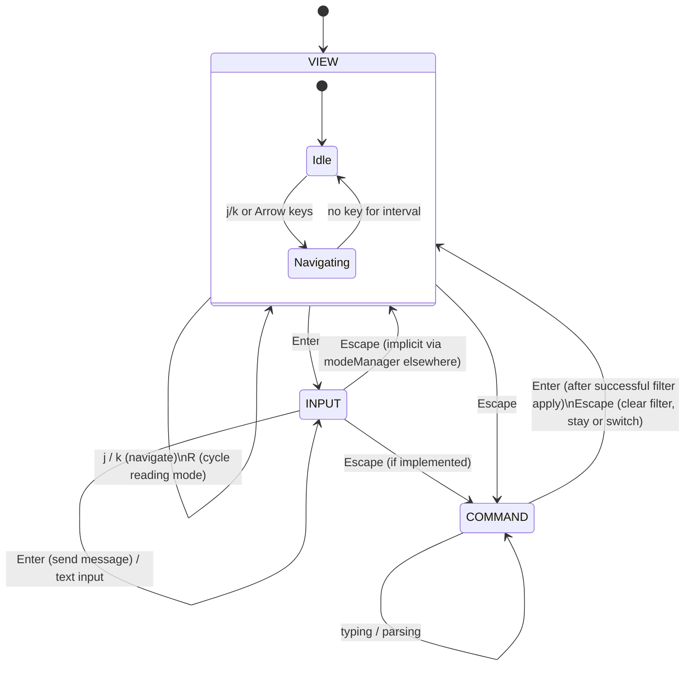

# Mode State Machine

Events:
- Enter in VIEW: switch to INPUT.
- Escape in VIEW: switch to COMMAND.
- Enter in COMMAND: parse & evaluate filter; on success → VIEW.
- R in VIEW: cycles reading position (top/center/bottom).
